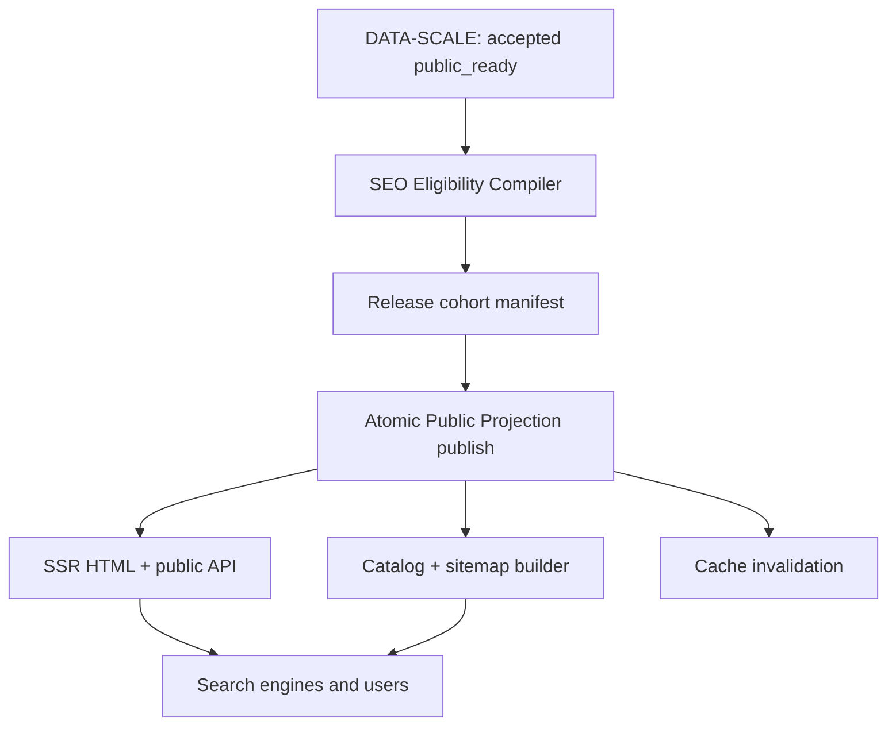

# SEO-10K RELEASE CONTRACT

**TASK-ID:** SEO-10K-PREP-01  
**Продукт:** nextcompany.pro  
**Версия:** 1.0  
**Дата:** 2026-09-27  
**Статус:** PREPARED / NOT RELEASED  
**Решение:** этот документ не разрешает публикацию 10 000 страниц. Он задаёт архитектуру и обязательные gate'ы для поэтапного выпуска 500 → 2 000 → 10 000 карточек после передачи DATA-SCALE 10 000 принятых `public_ready` проекций.

## 1. Обязательные инварианты

1. Каноническая карточка: `https://nextcompany.pro/companies/{INN}`.
2. `{INN}` — только проверенный десятизначный ИНН юридического лица. Двенадцатизначные ИНН ИП не входят в этот выпуск без отдельного legal/privacy acceptance.
3. Публичные HTML, API, метаданные, JSON-LD, OpenGraph, sitemap и каталоги строятся только из одной активной принятой Public Projection revision.
4. `public_ready = true` — необходимое, но недостаточное условие. Индексацию разрешает отдельный fail-closed SEO Eligibility Compiler.
5. Новый semantic contract обязателен: **Факт → Аналитика NEXT → Что проверить перед сделкой**.
6. Рекомендация не решает за пользователя, заключать ли сделку. Запрещены формулировки «надёжная компания», «рейтинг», «сделка возможна/невозможна» и аналогичные окончательные выводы.
7. Internal codes, enum names, raw objects, source payloads, технические reason codes и внутренние идентификаторы не попадают в HTML, title, description, H1, сниппет, OpenGraph, JSON-LD, sitemap, PDF/экспорт и публичный API.
8. Numeric Index 0–100, его диапазоны, производные bands и косвенные числовые оценки полностью выключены до отдельного final public feature acceptance. Legal-условия сами по себе не открывают feature flag.
9. `current`, `stale`, `disputed`, `unavailable` и `unknown` не взаимозаменяемы. Неактуальный или спорный отрицательный факт не может выглядеть как подтверждённый текущий.
10. Сбой worker/source не снимает принятую карточку. Публичный слой продолжает отдавать последнюю принятую revision, явно показывая её дату и статус свежести.
11. Fixtures, test pages, preview, admin/internal endpoints, поиск и API не индексируются.
12. В sitemap попадают только URL со статусом 200, self-canonical и `index_eligible = true`.

## 2. Production architecture



### 2.1 Разделение состояний

В production storage должны существовать независимые внутренние признаки:

| Поле | Назначение |
|---|---|
| `public_ready` | DATA-SCALE принял публичную проекцию |
| `semantic_ready` | скомпилированы разрешённые публичные Fact/Analytics/Action блоки |
| `seo_index_eligible` | все SEO/legal/data gates пройдены |
| `release_cohort` | `500`, `2000` или `10000` |
| `publication_state` | страница разрешена к выдаче публичным приложением |
| `active_revision_id` | единая revision для HTML/API/SEO |
| `search_visible_hash` | хэш только видимого и индексируемого содержания |
| `content_updated_at` | момент изменения видимого содержания, не время технического republish |

Это внутренние поля. Их значения и названия не выводятся пользователю и не сериализуются публичным API.

### 2.2 Fail-closed переход

Карточка становится индексируемой только при одновременном выполнении:

`public_ready AND semantic_ready AND seo_index_eligible AND publication_state=ACTIVE`.

Любой `false`, `null`, неизвестная версия контракта или ошибка компилятора означает `noindex,follow`, отсутствие URL в sitemap и отсутствие ссылки из индексируемых каталогов. Для ещё не выпущенной когорты предпочтителен 404, а не доступная «заготовка» с `noindex`.

## 3. Выбор и порядок когорты 10 000

### 3.1 Входной набор

DATA-SCALE передаёт ровно 10 000 принятых public-ready юридических лиц либо более широкий пул, из которого SEO выбирает первые 10 000. Существующие 40/500 карточек не получают автоматического grandfathering: они проходят те же правила.

До сбора спроса компания имеет статус `PENDING_DEMAND` и не может быть помещена в волну только по субъективной известности.

### 3.2 Источники спроса

Разрешены:

1. Яндекс Wordstat API: `topRequests`, `dynamics`, `regions`; география — Россия, язык запроса — русский; сохраняется 12-месячный срез и дата получения.
2. Google Ads Keyword Planner / `GenerateKeywordHistoricalMetrics`: Google Search, Россия, русский язык; используются средние и помесячные значения за последние 12 месяцев.
3. Google Search Console и Яндекс Вебмастер — только как first-party фактическая обратная связь после появления URL, а не как единственный источник для ещё не выпущенных компаний.
4. Логи внутреннего поиска nextcompany.pro — только агрегированные, очищенные от ботов и персональных данных; это дополнительный сигнал пользовательского намерения, не замена внешнему спросу.

**Keysso запрещён** до отдельного решения. Google autocomplete, выдача `site:`, количество результатов и ручная оценка бренда не считаются объёмом спроса.

### 3.3 Query set на одну компанию

Из принятых публичных имён формируется версионированный набор:

- точный ИНН;
- точное публичное краткое наименование;
- `краткое наименование + инн`;
- `краткое наименование + реквизиты`;
- `краткое наименование + проверить`;
- подтверждённое торговое имя с теми же модификаторами — только при доказанной связи с юридическим лицом.

Не используются ФИО руководителей, телефоны, адреса и непубличные алиасы. Запросы с отрицательной семантикой не генерируются как SEO-копирайтинг и не попадают в метаданные.

### 3.4 Entity resolution и неоднозначность

- ИНН-запрос всегда однозначен после checksum validation.
- Частотность названия засчитывается компании только при `entity_match_confidence = VERIFIED`.
- Если одно название относится к нескольким юрлицам, общий name-demand не присваивается ни одному из них. Допускается только спрос по ИНН либо по сочетанию название + регион/ИНН, которое однозначно разрешается.
- Торговое имя принимается только при наличии принятого публичного доказательства связи; само совпадение строк недостаточно.

### 3.5 Demand score

Для каждой системы вычисляется percentile rank среди всего eligible pool:

- `Y` — percentile от `log1p(12m_median_yandex)`;
- `G` — percentile от `log1p(12m_average_google)`.

Итог:

`DemandScore = 0.60 × Y + 0.40 × G`.

Если один обязательный источник временно недоступен, score не пересчитывается по одному источнику: запись получает `DEMAND_EVIDENCE_INCOMPLETE` и не проходит selection gate. Нулевой подтверждённый спрос допустим для последней волны только после исчерпания всех компаний с положительным спросом; порядок при равенстве: semantic completeness → freshness → ИНН по возрастанию.

Сезонность не скрывается: хранятся 12 помесячных значений, median, max/month и дата среза. Score и query set воспроизводимы по `demand_algorithm_version`.

### 3.6 Wave assignment

После hard gates компании сортируются по DemandScore:

1. `WAVE_500`: позиции 1–500.
2. `WAVE_2000`: позиции 501–2 000; итоговый публичный объём 2 000.
3. `WAVE_10000`: позиции 2 001–10 000; итоговый публичный объём 10 000.

Квоты по региону или отрасли не переопределяют спрос. Региональная/отраслевая диверсификация измеряется и может быть основанием пересмотреть алгоритм следующей версии, но не выполняется вручную внутри утверждённой версии.

### 3.7 Selection manifest

Внутренний manifest обязан содержать: INN, active revision, entity type, public-ready timestamp, query set hash, Wordstat snapshot ID, Google snapshot ID, 12m values, ambiguity decision, DemandScore, semantic gate result, freshness result, index eligibility, wave, algorithm version и причины исключения. Manifest подписывается хэшем и не публикуется.

## 4. URL contract и canonical

| Объект | URL | Индексация |
|---|---|---|
| Карточка | `/companies/{INN}` | по `seo_index_eligible` |
| Каталог | `/companies` | да после gate |
| Пагинация | `/companies/page/{N}` | да, если страница непустая и разрешена |
| Регион | `/companies/regions/{slug}` | только demand + content gate |
| Регион, страница N | `/companies/regions/{slug}/page/{N}` | по pagination gate |
| Отрасль | `/companies/industries/{okved2}-{slug}` | только demand + content gate |
| Отрасль, страница N | `/companies/industries/{okved2}-{slug}/page/{N}` | по pagination gate |
| Поиск | `/search?...` | `noindex,follow` |
| API | `/api/company/{INN}` | `X-Robots-Tag: noindex, nofollow, nosnippet` |

Нормализация:

- HTTP → HTTPS: 308.
- `www.nextcompany.pro` → `nextcompany.pro`: 308.
- `/company/{inn}` → `/companies/{INN}`: 308.
- trailing slash у карточки → URL без slash: 308.
- параметры tracking на карточке → чистый URL через 308, если параметр не влияет на представление.
- неверный формат/checksum ИНН → 404, не soft-404.
- все внутренние ссылки используют только canonical URL.

Каждая индексируемая HTML-страница содержит абсолютный self-canonical в исходном SSR HTML. Canonical, redirect target, sitemap URL, OpenGraph URL и внутренние ссылки обязаны совпадать побайтно.

## 5. SEO eligibility

### 5.1 Обязательные условия карточки

Карточка индексируема только если:

1. entity type — принятое юридическое лицо; ИНН валиден и уникален;
2. active Public Projection соответствует поддерживаемой schema version;
3. core identity не спорна: публичное название, ИНН и связь revision с компанией подтверждены;
4. SSR отвечает 200 и не зависит от домашнего worker/operational DB;
5. title, description, H1, public status и JSON-LD скомпилированы из allowlist;
6. semantic-content gate из §7 пройден;
7. freshness/dispute policy из §12 пройдена;
8. URL отсутствует в legal takedown, fixture/test и duplicate registries;
9. отсутствуют forbidden tokens и raw serialization;
10. search-visible hash уникален для этой сущности и не совпадает с другой карточкой целиком;
11. canonical, index directive и sitemap membership согласованы;
12. страница имеет хотя бы одну crawlable internal link от индексируемого каталога или другой индексируемой страницы.

### 5.2 Результаты

- `INDEX`: `index,follow`; присутствует в sitemap и каталогах.
- `NOINDEX_RECOVERABLE`: `noindex,follow`; нет в sitemap; может открываться пользователю с корректным состоянием.
- `NOT_PUBLISHED`: 404; нет ссылок и sitemap.
- `GONE`: 410 только для окончательного legal removal/ошибочной сущности; удаляется из ссылок и sitemap.

HTTP 200 с пустой карточкой, ошибкой, «компания не найдена» или загрузочным skeleton запрещён.

## 6. Page template и метаданные

### 6.1 H1

`H1 = публичное краткое наименование`.

Под H1 отдельной строкой: `ИНН {INN}`. Не добавлять в H1 «проверка», «надёжность», внутренний статус риска или Numeric Index.

### 6.2 Title

Основное правило:

`{Краткое наименование} — ИНН {INN}: сведения о компании | NEXT`

Fallback при отсутствии принятого краткого имени:

`{Полное наименование} — ИНН {INN} | NEXT`

Выбирается самое короткое принятое публичное имя. Нельзя обрезать юридическое имя посередине слова, подменять его непринятым брендом или добавлять keyword list. В title запрещены задолженность, правонарушение, риск, score/band, disputed/stale assertions и любые internal labels.

### 6.3 Meta description

Собирается только из реально присутствующих нейтральных фактов:

`{Публичное имя}, ИНН {INN}[, ОГРН {OGRN}]. Статус: {публичная формулировка}. Регистрационные сведения, источники и даты обновления на NEXT.`

- отсутствие поля удаляет весь фрагмент, а не создаёт «нет данных»;
- статус проходит public wording map;
- целевой размер 120–170 знаков, но точность важнее длины;
- запрещены adverse facts, вывод о сделке, Numeric Index, raw code и недоказанное торговое имя;
- description каждой карточки должна быть уникальной как минимум по имени и ИНН.

### 6.4 OpenGraph

`og:title` и `og:description` используют те же безопасные компиляторы; `og:url` равен canonical; `og:type=website`. Изображение — только общий одобренный NEXT card, без сгенерированного score/risk badge.

### 6.5 Public wording map

Все внутренние enum преобразуются до template boundary. Неизвестный enum не отображается как строка и блокирует SEO eligibility. Примеры разрешённых пользовательских формулировок: «Действующая организация», «Организация ликвидирована», «Статус уточняется», «Данные проверяются», «Источник временно недоступен», «Данные требуют обновления».

## 7. Semantic-content requirements и thin-page protection

### 7.1 Обязательная структура

Карточка содержит три связанные зоны:

1. **Факты:** конкретные значения, источник, дата данных и дата получения.
2. **Аналитика NEXT:** объяснение значения фактов и ограничений без окончательного решения за пользователя.
3. **Что проверить перед сделкой:** конкретные проверяемые действия, привязанные к фактам и их свежести.

Analytics и Action не могут существовать без ссылочного `fact_id` текущей Public Projection. Генерация свободного текста без структурной связи запрещена.

### 7.2 Minimum semantic gate

Для `INDEX` одновременно обязательны:

- минимум 4 заполненных core identity facts, среди которых всегда имя и ИНН;
- минимум 3 entity-specific facts помимо имени и ИНН;
- минимум 2 принятых публичных source references;
- минимум 1 dated source fact;
- минимум 1 разрешённый Analytics block, основанный на видимом fact;
- минимум 1 Action block «Что проверить перед сделкой», основанный на том же или другом видимом fact;
- видимые source date, result date и freshness wording;
- ни один обязательный блок не состоит только из boilerplate/placeholder.

Word-count сам по себе не является gate. Страница, которая набрала слова повторением шаблона, остаётся thin.

### 7.3 Thin page

Карточка получает `NOINDEX_RECOVERABLE`, если есть только название/ИНН/общий шаблон; нет двух источников; нет датированного факта; Analytics/Action не основаны на фактах; более половины смысловых блоков — `unknown/unavailable`; либо после удаления имени и идентификаторов body совпадает с пустым шаблоном.

Перед каждой волной выполняется cluster audit `non_identity_content_hash`. Кластер из 50+ практически одинаковых страниц блокируется до выборочной ручной проверки 20 страниц и подтверждения, что сходство объясняется реальными одинаковыми фактами, а не генератором пустого текста.

## 8. Structured data

### 8.1 Company page

SSR JSON-LD `@graph` содержит:

- `WebPage` с canonical `url`, публичными `name` и `description`;
- `Organization` как `mainEntity` с принятыми `name`, `legalName`, `identifier` (ИНН/ОГРН), `address` и `foundingDate` только если они видимы на странице и разрешены Public Projection;
- `BreadcrumbList`.

Не использовать `LocalBusiness` без доказанной применимости. Запрещены `Review`, `AggregateRating`, `ratingValue`, `score`, `ClaimReview` и Numeric Index. Structured data не содержит долг, нарушение, риск или disputed/stale adverse facts.

### 8.2 Catalog page

`CollectionPage` + `ItemList`; каждый item содержит только position, canonical URL и публичное имя компании. Порядок JSON-LD совпадает с видимым списком.

### 8.3 Validation

JSON-LD должен:

- проходить schema syntax validation;
- не содержать данных, отсутствующих в видимом HTML;
- быть детерминированным для одной revision;
- не обещать rich result: разметка помогает пониманию страницы, но не гарантирует специальный вид выдачи.

## 9. robots и meta robots

Production `robots.txt`:

```text
User-agent: *
Allow: /
Disallow: /internal/
Disallow: /admin/
Disallow: /docs
Disallow: /openapi.json

Sitemap: https://nextcompany.pro/sitemap.xml
```

Правила:

- robots.txt не используется как механизм canonical или как замена `noindex`;
- HTML, который должен получить `noindex`, остаётся доступным crawler'у, чтобы directive был прочитан;
- `/search` отвечает 200 с `noindex,follow` и не попадает в sitemap; ссылки на пользовательские query URL не генерируются сервером;
- API не связывается из индексируемого HTML и отдаёт `X-Robots-Tag: noindex, nofollow, nosnippet`; `/api/` не блокируется в robots.txt, иначе crawler не сможет прочитать этот запрет индексации;
- staging/preview закрыты авторизацией и глобальным `noindex`; одного robots.txt недостаточно;
- tracking parameters не создают индексируемые варианты; для Яндекса поддерживается проверенный `Clean-param` только после инвентаризации реально используемых параметров.

## 10. Sitemap architecture

### 10.1 Структура

- `/sitemap.xml` — sitemap index.
- `/sitemaps/static.xml.gz` — landing и принятые catalog pages.
- `/sitemaps/companies-00.xml.gz` … `/sitemaps/companies-0f.xml.gz` — 16 стабильных company shards.

Shard определяется детерминированно: первые 4 бита `SHA-256(INN)`. Алгоритм не меняется между волнами, поэтому карточка не мигрирует между файлами при росте 500 → 2 000 → 10 000.

### 10.2 Inclusion rules

Каждый URL в sitemap:

- абсолютный HTTPS canonical на apex host;
- отвечает 200;
- имеет self-canonical;
- имеет `index,follow`;
- принадлежит active released cohort;
- отсутствует в redirect/noindex/404/410/5xx;
- содержит `<lastmod>` только из `content_updated_at`.

Технический republish без изменения `search_visible_hash` не обновляет `<lastmod>`. `changefreq` и `priority` не используются. Sitemap генерируется из той же atomic snapshot, что и active public revision.

10 000 URL технически помещаются в один sitemap, но 16 shards выбраны для локальной регенерации, наблюдаемости и rollback. Каждый shard обязан быть валидным UTF-8 XML, gzip-readable и значительно ниже лимитов 50 000 URL/50 MB.

## 11. Catalog pages, pagination и internal linking

### 11.1 Catalog eligibility

`/companies` индексируется после появления минимум 20 index-eligible карточек.

Региональная или отраслевая посадочная создаётся только если одновременно:

- есть подтверждённый спрос по теме каталога в Wordstat и Google;
- минимум 20 index-eligible компаний;
- есть уникальные H1/title/description;
- есть короткое фактическое описание выборки, дата среза и метод группировки;
- отсутствует SEO-текст, сгенерированный перестановкой ключей;
- catalog page имеет устойчивый slug и не зависит от пользовательского sort/filter.

Не создавать алфавитные, городские, ОКВЭД-дочерние и комбинированные страницы «на всякий случай». Новый тип каталога требует отдельного demand evidence и acceptance.

### 11.2 Pagination

- первая страница canonical на base URL без `/page/1`;
- `/page/1` делает 308 на base;
- страницы 2+ self-canonical, не canonical на первую страницу;
- переходы — обычные SSR `<a href>`; обязательны next, previous, первая страница и соседние номера;
- target page size — 24 компании;
- если последняя страница содержит меньше 12 компаний, элементы равномерно перераспределяются между двумя последними страницами;
- пустая и превышающая последнюю страница отвечает 404;
- sort/filter/query variants — `noindex,follow`, не sitemap;
- бесконечная прокрутка допустима только как progressive enhancement поверх crawlable pagination.

### 11.3 Internal links

Каждая индексируемая карточка получает:

- breadcrumb «Главная → Компании → Название»;
- ссылку на общий каталог;
- ссылки только на принятые indexable region/industry catalogs;
- 4–8 ссылок на «Компании того же основного вида деятельности в регионе», если такой набор существует.

Последний блок не называется «связанные компании» и не заявляет юридическую/деловую аффилированность. Алгоритм детерминирован, выбирает только index-eligible URL и исключает текущую компанию.

Orphan rate для index-eligible карточек — 0. Все ссылки имеют реальный `<a href>` и осмысленный anchor: публичное имя, при неоднозначности — имя + ИНН.

## 12. Duplicate, stale и disputed policy

### 12.1 Duplicate prevention

- один валидный ИНН → один canonical URL;
- URL-алиасы только 308, не параллельные 200;
- карточки не создаются по имени, slug, КПП или ОГРН;
- tracking/filter/sort URL не попадают в sitemap;
- title/H1/canonical uniqueness проверяются на полном released set;
- при подтверждённом ошибочном сопоставлении ИНН и сущности URL удаляется из sitemap немедленно; 301 на другой ИНН допускается только при документированном entity-resolution correction, иначе 410.

### 12.2 Stale data

Stale одного неключевого source module не снимает всю карточку с индекса, если core identity и minimum semantic gate остаются действительными. На странице модуль явно помечается «Данные требуют обновления» с датой. Stale adverse fact:

- не попадает в title/description/OpenGraph/JSON-LD;
- оборачивается в `data-nosnippet` для Google и валидный комментарий `<!--noindex-->…<!--/noindex-->` для исключения фрагмента из индекса/сниппета Яндекса;
- не формулируется в настоящем времени;
- сопровождается source date и рекомендацией перепроверить источник.

Если stale/unknown делает core identity непроверенной либо карточка больше не проходит minimum semantic gate, карточка становится `NOINDEX_RECOVERABLE` и удаляется из sitemap до новой принятой revision.

### 12.3 Disputed data

Спорное поле заменяется публичным состоянием «Данные проверяются»; спорное значение и вывод на его основе исключаются из SEO metadata, JSON-LD и snippet-eligible text. Сохраняются путь сообщения об ошибке, дата и нейтральное описание проверки.

- спор по отдельному модулю: карточка может оставаться indexable, если core identity и minimum semantic gate пройдены без этого модуля;
- спор по имени, ИНН, принадлежности revision или статусу сущности: немедленный `noindex,follow`, удаление из sitemap и indexable catalogs;
- после разрешения спора публикуется новая revision; предыдущий disputed текст не возвращается из cache.

### 12.4 Source unavailable / unknown

Недоступность источника и отсутствие события — разные состояния. Нельзя писать «нарушений нет» или «задолженности нет», если источник недоступен, результат неизвестен или не проверен. Такие блоки не создают позитивный SEO-текст.

## 13. Republishing и cache invalidation

### 13.1 Atomic publish

1. Собрать новую Public Projection revision и SEO projection вне active namespace.
2. Проверить schema, semantic contract, forbidden tokens, URL/canonical и sitemap delta.
3. Сформировать signed release manifest с old/new revision, content hash, изменёнными INN и затронутыми catalog/shard IDs.
4. Одной транзакцией переключить active revision pointer.
5. Только после commit публиковать invalidation event.

HTML и API никогда не смешивают поля разных revisions.

### 13.2 Cache keys

- company HTML/API: `INN + active_revision_id + representation_version`;
- catalog: `catalog_id + catalog_revision`;
- sitemap: `shard_id + sitemap_revision`.

ETag строится из representation hash. Поддерживаются `If-None-Match` и 304. После activation очищаются canonical card, API representation, все catalogs с этой компанией, соответствующий sitemap shard и OG preview. Purge повторяемый и идемпотентный.

### 13.3 Failure and rollback

- ошибка до active-pointer commit ничего не меняет;
- ошибка invalidation после commit повторяется из durable outbox;
- smoke failure после activation откатывает pointer на предыдущую принятую revision, затем повторно invalidates затронутые ключи;
- outage домашнего worker не влияет на чтение текущей public revision;
- при rollback sitemap и HTML должны вернуться к одной revision не позднее 5 минут.

## 14. Rollout 500 → 2 000 → 10 000

### 14.1 Общий принцип

Волны кумулятивны. Не выпущенные URL не доступны как 200, не связаны внутренними ссылками и отсутствуют в sitemap. Активация волны — отдельный versioned release manifest и feature flag.

### 14.2 Wave 500

Выпустить top-500 по DemandScore после прохождения всех pre-release gates. Окно наблюдения до допуска Wave 2 000: минимум 14 последовательных полных суток после первого подтверждённого обхода Googlebot и YandexBot; если достаточных данных нет к 21-м суткам, решение остаётся `HOLD`, а не автоматически `PASS`.

### 14.3 Wave 2 000

Добавить следующие 1 500 только после `WAVE_500_ACCEPTED`. Окно наблюдения: минимум 14 полных суток. Любая регрессия считается по всему кумулятивному набору 2 000.

### 14.4 Wave 10 000

Добавить последние 8 000 только после `WAVE_2000_ACCEPTED`. Перед включением повторно прогнать full-corpus gates на всех 10 000, capacity test с 5-кратным ожидаемым bot peak и rollback drill. После выпуска — 21 день усиленного наблюдения.

## 15. Exact acceptance gates

Все обязательные gate'ы имеют только `PASS`, `FAIL`, `NOT_RUN`. `NOT_RUN` блокирует волну. Исключение возможно только отдельным решением 00 с owner, сроком и compensating control; оно не может отменить privacy leak, raw/internal leak, semantic misrepresentation, invalid canonical или Numeric Index ban.

### A. Pre-release gates — обязательны перед Wave 500

| ID | Gate | PASS |
|---|---|---|
| SEO10K-A01 | Input integrity | Ровно заявленный pool; 100% unique INN; checksum valid; active revision pinned; 0 fixtures/test records |
| SEO10K-A02 | Entity scope | 100% — юридические лица; ИП = 0 в release manifest |
| SEO10K-A03 | Public boundary | Full recursive scan 10 000 projections: 0 raw payloads, internal objects/codes, secrets, worker/job fields, private evidence |
| SEO10K-A04 | Numeric Index off | 0 упоминаний/полей score 0–100, band, rating и их derived display во всех public representations |
| SEO10K-A05 | Semantic compiler | 10 000/10 000 обработаны детерминированно; неизвестная schema/enum fail-closed; compiler version pinned |
| SEO10K-A06 | Demand evidence | Wordstat + Google 12m snapshots присутствуют для 100% ranked candidates; query-set/entity resolution воспроизводимы; Keysso usage = 0 |
| SEO10K-A07 | Cohort manifest | 500/1 500/8 000 без пересечений и пропусков; сортировка повторяется побайтно; manifest hash сохранён |
| SEO10K-A08 | Index eligibility | Для Wave 500 500/500 проходят все eligibility gates; остальные не опубликованы и не находятся в sitemap/catalog links |
| SEO10K-A09 | SSR consistency | HTML, JSON-LD, OG и API каждого Wave-500 URL читают один `active_revision_id`; 0 network writes/external fetches на GET |
| SEO10K-A10 | URL contract | Full crawl: canonical cards 200; все legacy/host/scheme/slash variants дают один hop 308; invalid INN — real 404 |
| SEO10K-A11 | Metadata | 500/500 unique title, description, H1; 0 missing-field hallucinations; 0 forbidden/internal tokens; 0 adverse facts в metadata |
| SEO10K-A12 | Structured data | 500/500 syntax valid; visible-content parity; forbidden schema properties = 0; Breadcrumb valid |
| SEO10K-A13 | Thin content | 500/500 проходят §7.2; все hash-clusters ≥50 проверены; unreviewed clusters = 0 |
| SEO10K-A14 | Freshness/dispute | 100% states mapped; stale/disputed negative assertions отсутствуют в metadata/JSON-LD/snippet-eligible blocks; core disputes indexable = 0 |
| SEO10K-A15 | robots/meta | Production robots valid; search noindex; API X-Robots; staging protected; нет конфликта robots/noindex |
| SEO10K-A16 | Sitemap | Index + 16 shards valid; membership равен eligible released set; 0 redirect/noindex/error URLs; lastmod from visible change only |
| SEO10K-A17 | Catalog/navigation | Orphan eligible URLs = 0; pagination crawlable; page/1 redirects; empty/out-of-range = 404; filter/sort absent from sitemap |
| SEO10K-A18 | Cache/republish | Update, dispute, no-op republish и rollback tests PASS; stale content after purge = 0; convergence ≤5 min |
| SEO10K-A19 | Reliability | 24h staging soak; availability ≥99.9%; 5xx <0.1%; p95 HTML TTFB ≤800 ms under 5× expected bot peak |
| SEO10K-A20 | Recovery | Home worker offline drill PASS; site serves last revision; DB restore + active revision invariant PASS |
| SEO10K-A21 | Search consoles | Apex HTTPS property verified in Google Search Console and Yandex Webmaster; sitemap submission procedure rehearsed |
| SEO10K-A22 | Legal/error path | Methodology/source/date links and report-error flow work; legal takedown and 410 procedure tested |

### B. Wave 500 → Wave 2 000 gates

| ID | Gate | PASS after observation window |
|---|---|---|
| SEO10K-B01 | Runtime | 14-day availability ≥99.9%; total and verified-bot 5xx <0.1%; no unresolved Sev-1/Sev-2 |
| SEO10K-B02 | Leakage | Automated full crawl + manual stratified sample 100: 0 internal/raw/Numeric Index leaks |
| SEO10K-B03 | Sitemap processing | Google and Yandex accepted sitemap index; parse/fetch errors = 0 |
| SEO10K-B04 | Canonical/duplicates | Search-console canonical conflict or duplicate-selected-other URL ≤2% of submitted; soft-404 = 0 |
| SEO10K-B05 | Discovery/indexing | ≥90% submitted discovered/crawled; ≥60% indexed in at least one engine and ≥40% in each engine; otherwise HOLD |
| SEO10K-B06 | Snippet safety | 100 SERP samples across demand deciles: 0 misleading current claims, internal codes, Numeric Index or disputed/stale adverse assertions |
| SEO10K-B07 | Query relevance | В ручной выборке 100 impression-bearing query→page pairs ≥90% относятся к правильной сущности; mismatch = 0 для ИНН-запросов |
| SEO10K-B08 | Data/product quality | 0 подтверждённых false-positive public claims; все report-error обращения triaged в SLA; unresolved core disputes indexable = 0 |
| SEO10K-B09 | Performance | При ≥100 реальных RUM-сессиях: p75 LCP ≤2.5 s, INP ≤200 ms, CLS ≤0.1. При меньшей выборке: 100 production synthetic runs на 20 representative URL дают LCP ≤2.5 s, CLS ≤0.1 и scripted interaction latency ≤200 ms; метод evidence явно отмечен |
| SEO10K-B10 | Rollback readiness | Production-like cohort rollback и повторная activation PASS; sitemap/HTML/API converge ≤5 min |

### C. Wave 2 000 → Wave 10 000 gates

| ID | Gate | PASS after observation window |
|---|---|---|
| SEO10K-C01 | Full-corpus rerun | A01–A18 повторно PASS на всех 10 000; A19 capacity test PASS на целевой topology |
| SEO10K-C02 | 2K runtime | 14-day availability ≥99.9%; total и bot 5xx <0.1%; p95 TTFB ≤800 ms |
| SEO10K-C03 | 2K indexing | ≥90% discovered/crawled; ≥65% indexed in at least one engine и ≥45% в каждом; тренд 7 дней не отрицательный |
| SEO10K-C04 | Quality exclusions | thin, duplicate, core-disputed, fixture/test URL в indexable set = 0 |
| SEO10K-C05 | Catalog quality | Каждый indexable catalog проходит demand/content gate; orphan rate = 0; неразрешённых facet URL в индексе = 0 |
| SEO10K-C06 | Semantic audit | Стратифицированная выборка 200 карточек: Fact→Analytics→Action traceability = 100%; misleading recommendation = 0 |
| SEO10K-C07 | Demand model | Query/entity mismatch ≤10% в выборке 200; ИНН mismatch = 0; snapshots не старше одного monthly refresh cycle |
| SEO10K-C08 | Cache/rollback at scale | 10K publish simulation, single-shard rebuild, multi-shard invalidation и full rollback PASS; convergence ≤5 min |
| SEO10K-C09 | Capacity | 5× measured Wave-2K verified-bot peak выдержан 30 min; error rate <0.1%; DB pool saturation events = 0 |
| SEO10K-C10 | Decision record | 00 получает evidence bundle и явно фиксирует `GO_10000`; отсутствие решения = HOLD |

### D. Post-10K acceptance

Через 21 день после Wave 10 000:

- 10K runtime и leakage gates продолжают выполняться;
- sitemap membership равен active eligible set;
- ≥90% URL discovered/crawled;
- ≥65% indexed в хотя бы одном поисковике и ≥45% в каждом;
- duplicate-selected-other ≤2%, soft-404 = 0;
- 200 SERP samples проходят snippet safety на 100%;
- ни одна stale/disputed/core-correction revision не осталась в cache после 5 минут;
- 00 получает итог `ACCEPTED`, `ACCEPTED_WITH_ACTIONS` или `ROLLBACK/HOLD` с evidence.

Индексация не гарантируется sitemap или разметкой; эти пороги являются внутренними rollout stop/go gates, а не обещанием поисковика.

## 16. Measurement

Dashboard разделяется по engine, wave, sitemap shard, catalog type и eligibility reason:

- submitted, discovered, crawled, indexed;
- excluded by noindex, duplicate/canonical, crawled-not-indexed, soft-404;
- Google/Yandex impressions, clicks, CTR, average position;
- branded/name/INN/verification-intent query classes;
- query→entity mismatch;
- bot status codes, p50/p95 TTFB, cache hit ratio;
- eligible/noindex counts by reason;
- stale/disputed/source-unavailable counts;
- report-error rate and resolution time;
- organic landing → source/date expansion → «Что проверить» interaction → next search.

Не объединять `FOUND` и freshness в один статус. Не трактовать рост трафика как доказательство качества данных. SEO и продукт принимаются совместно: misleading fact блокирует rollout даже при росте impressions.

## 17. Required implementation artifacts

До Wave 500 должны существовать и быть versioned:

1. SEO Eligibility Compiler и schema.
2. Semantic SEO Renderer с allowlist и forbidden-token tests.
3. Demand collector/adapters для Wordstat и Google historical metrics.
4. Entity-resolution/ambiguity registry.
5. Cohort ranking job и signed manifest.
6. SSR metadata/JSON-LD builders.
7. Robots, sitemap index и deterministic shard generator.
8. Catalog/pagination builder.
9. Cache invalidation outbox и rollback command.
10. Full-crawl acceptance suite и evidence exporter.
11. Search Console/Yandex Webmaster ingestion dashboard.
12. Runbooks: wave activation, HOLD, rollback, dispute, legal takedown, sitemap repair.

## 18. Evidence boundary

Приложенный Engineering Knowledge Corpus 1.0.0 использован как общий guardrail для раздельных result/freshness и проверяемых release gates. Его собственные файлы фиксируют `DOCUMENTATION_READY`, но `production_accepted=false` / `production acceptance NOT_RUN`; поэтому они не являются доказательством готовности nextcompany.pro к 10K.

Актуальные внешние основания:

- Google canonical: https://developers.google.com/search/docs/crawling-indexing/consolidate-duplicate-urls
- Google sitemap: https://developers.google.com/search/docs/crawling-indexing/sitemaps/build-sitemap
- Google pagination: https://developers.google.com/search/docs/specialty/ecommerce/pagination-and-incremental-page-loading
- Google links: https://developers.google.com/search/docs/crawling-indexing/links-crawlable
- Google snippets: https://developers.google.com/search/docs/appearance/snippet
- Google structured data: https://developers.google.com/search/docs/appearance/structured-data/intro-structured-data
- Google Keyword historical metrics: https://developers.google.com/google-ads/api/docs/keyword-planning/generate-historical-metrics
- Yandex canonical: https://yandex.ru/support/webmaster/en/robot-workings/canonical
- Yandex sitemap: https://yandex.ru/support/webmaster/en/controlling-robot/sitemap
- Yandex Wordstat API: https://yandex.ru/support2/wordstat/en/content/api-structure
- Yandex partial-text noindex: https://yandex.ru/support/webmaster/en/adding-site/indexing-prohibition

## HANDOFF → 00 — Управление проектом

**Результат:** SEO-10K production contract подготовлен; публикация 10 000 не выполнялась.

**Решение для 00:** создать implementation TASK на SEO Eligibility Compiler, semantic renderer, demand evidence pipeline, sitemap/catalog/cache architecture и evidence suite. Запускать только Wave 500 и только после PASS всех SEO10K-A01…A22. Wave 2 000 и Wave 10 000 являются отдельными release decisions; автоматическое расширение запрещено.

**Главные блокеры до исполнения:** нет подтверждённого demand manifest Wordstat + Google, нет full-corpus semantic/forbidden-field evidence, не выполнены indexability/sitemap/cache/rollback tests и production observation gates. Текущий статус 10K: **NOT RELEASED / HOLD BY DESIGN**.
